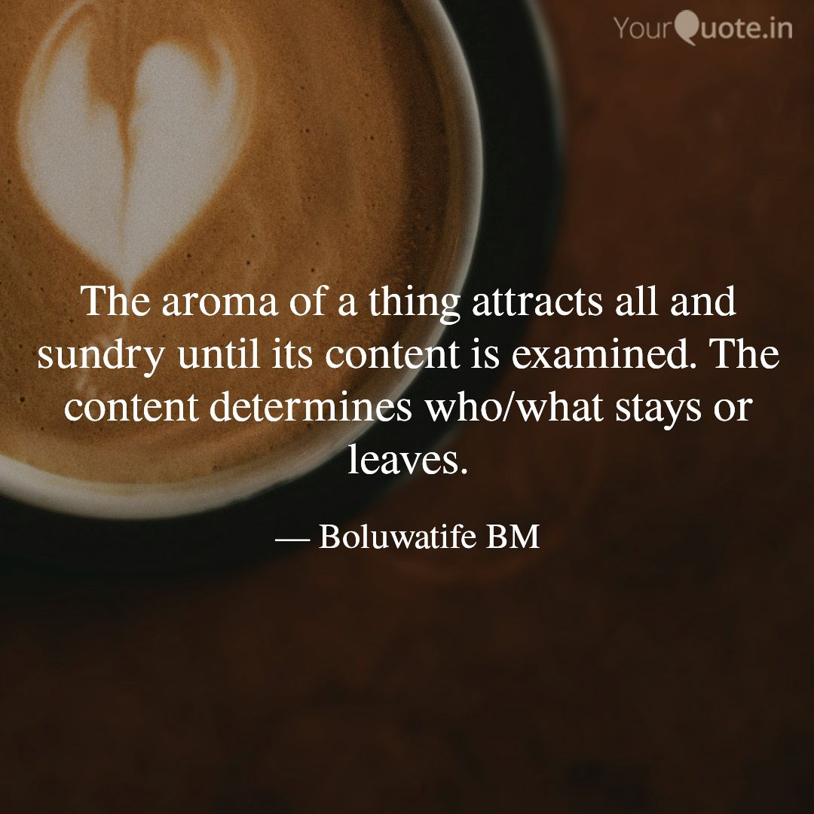

Have you ever perceived the aroma of a food/snack that was awful? Regardless of where the aroma comes from, doesn't it always have a pleasant appeal to anyone to come in? What's the usual internal response when you perceive the aroma? Isn't it the feeling that a bite would be refreshing? If you get an opportunity to taste one of such meals/snacks, your expectation wilĺ either be met, exceeded, or dashed.

What happens when you find out that the aroma would taste better than the food/snack itself? Don't you wonder about the cause of the disparity between the appealing invite of the aroma and the repelling taste of the food? It's either an ingredient was excess or inadequate. It could even be that the whole recipe was muddled up. We end up disappointed, and it makes us begin to question every other aroma we perceive. We can either manage to consume the meal or do something else with them.

This phenomenon also applies to every human being. Men see a person's appearance, carriage, or a particular action and feel that what they see would be a reflection of the person's heart. Alas! The heart seems to differ tangibly from what the face says or the hands have done. There was a kind act but it was just for the moment. The respect given to everyone at the gathering was just a facade to incite acceptance at first sight. The alacrity with which work was done was to seal the promotion deal. The hands of love extended to people around me were primarily to massage my ego. My religious activities are formulated covers for the inadequacies locked up within me. The list goes on and on... These realities dictate the kind of people we end up with for marital relationships, business, friendship, etc. Men can attempt to move closer because of first impressions but look forward to more than that before they really commit to the relationship.

What are your plans to work your heart into alignment with your appearance and actions? Are you paying keen attention to the state of your heart and more importantly, to its growth?