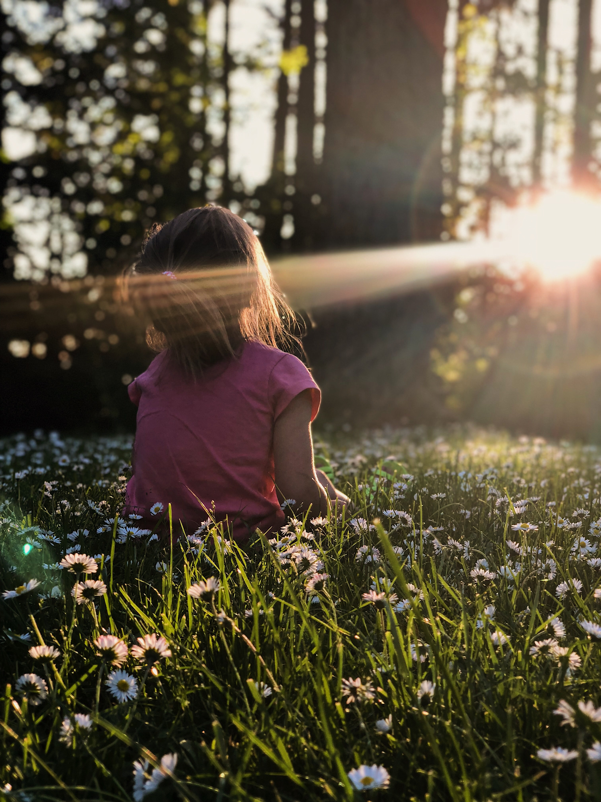

How do we teach our heart to stop concentrating on the things we see/hear daily, and focus on the reality of the Word of God?

How do we learn to suspend today's gratification so we can lay hold of tomorrow's glory?

How do we cease from sinking in the surrounding storm and look to Jesus, the Author, and Finisher?

How do we tell our souls to rejoice in the midst of sorrow and confusion?

Isaiah 30:15 *For thus said the Lord God, the Holy One of Israel: In returning \[to Me] and resting \[in Me] you shall be saved; in quietness and in \[trusting] confidence shall be your strength. But you would not,*

Be Still!!!

Are you weary from a lot of activities and you don't seem to feel His presence? Be Still!

Are you currently overwhelmed by the numerous failures you've been through? Be Still!

Seems there is a need that wants to remain unmet despite several attempts you've made? Be Still!

There's a decision to be made and several choices are calling out to you? Be Still!

How?

Tell yourself it's time to be still;

Take a break and go back to the secret where your Father is;

 Tell Him everything, leave no detail out, just as you would to a close friend;

Let the Holy Spirit help you continue with Thanksgiving...
And receive the peace that He brings... the peace could come with a scripture or an instruction.

It is only when you're still that you can know that He is God... It is in stillness we hear Him clearly... His Spirit is gentle, and wouldn't compete with the voices of fear, doubt, people, activities, etc.

Psalm 42:5 *So then, my soul, why would you be depressed? Why would you sink into despair? Just keep hoping and waiting on God, your Savior. For no matter what, I will still sing with praise, for living before his face is my saving grace!*
 Proverbs 1:33 *But the one who always listens to me will live undisturbed in a heavenly peace. Free from fear, confident and courageous, you will rest unafraid and sheltered from the storms of life.*