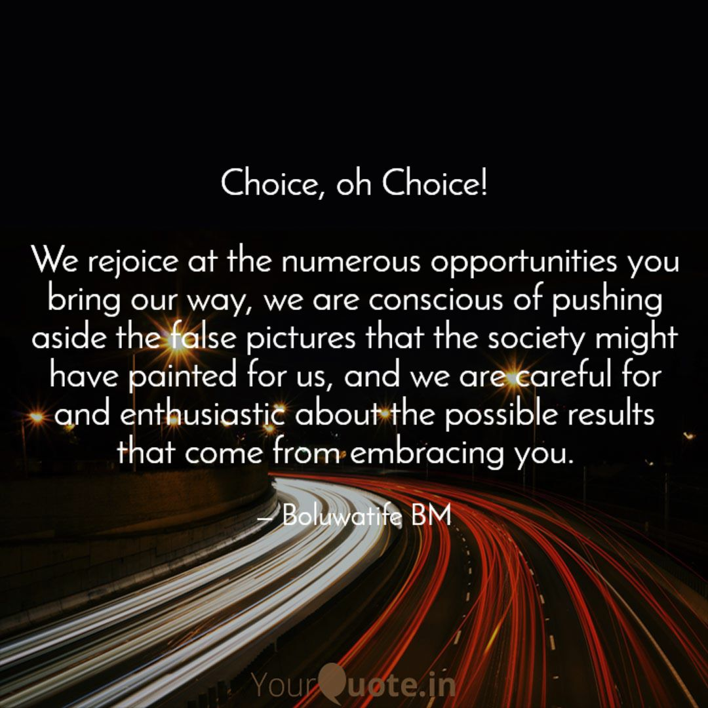

Decisions have to be made and steps taken! No man can stand still in life and avoid choices. The very decision to avoid choices and standstill is a choice in itself. It is undeniable that every day gives a trailer load of choices, from waking up, taking your bath, and eating, to how you make friends, the mode of transportation, who you partner with, and a host of many others. Amazingly, most of the choices run concurrently such that they become default modes for us. 

Knowing that some of these choices have become default modes, it becomes imperative to take time to reanalyze each of them. Are they what we really want? Will they deliver the future we are seeing? Will they increase or decrease the quality of our lives? Are the long-term benefits of the choices going to be as beautiful as or more beautiful than the short-term benefits? Don't be deceived! Some of the choices we make, especially those that have become default for us (examples are eating junk, oversleeping, procrastination, and more intense ones), tend to give immediate pleasure but heap a bag of regrets on us sooner or later than we think.

"Wisdom is profitable to direct," says the wisest man that ever lived. Take responsibility for your life. Start from picturing who you were created to be, and who you are now. Chart a path of how you will move from who you are now to who you were made to be. Take counsel from the wise, and much more, don't neglect the Wisdom of God. Don't attempt to disappear to the top of your choices; start from where you are and take one step at a time; allow yourself to grow. In the end, what matters is what you decide to do with the numerous gifts (choices) God gives to you through each day that comes. Live your life deliberately, not accidentally!