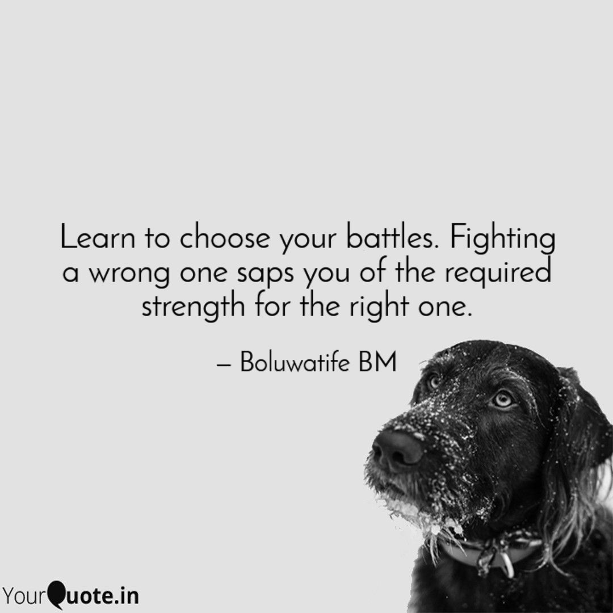

Can you imagine filling your stomach with cake and yogurt only to realize that they were appetizers for the real meal, Jollof rice and chicken with salad? Oh mine! It's possible to go ahead and eat the meal, but eating it won't give the pleasure and nutrients it should because the stomach and its army have been overworked already. Rather, constipation and its other attendants may be quick to visit. The other option is to keep it till the initial filling has digested, but then, it won't be as fresh as it was (that's if you get the chance to keep it anyway).

Let's take another travel into imagination. Imagine two brothers walking down the road to pick up a bag that none of them can carry alone, and an argument came up that made them speak unkindly to one another. Not willing to give peace a chance, though the destination was still in view, in the heat of the moment, one of them angrily turned back, while the other kept going, angrily too though. The person that went back returned home without the bag while the person that didn't turn got to where the bag was but couldn't carry it alone. If the bag will be carried, the one at home would have to start the journey again while the other waits, or the one with the bag would have to search for another person with the same destination as his who is willing and able to assist (such is not easy to come by). Wasted time and wasted efforts!

The two scenarios above give some insights into how we live. We choose to hold onto a person's offense even when we know it is nothing compared to the value of our relationship with them. We are waiting for an apology from our partner(s) even when we know that the delay is tearing our unity in the Spirit apart. We are quick to shout on the vulnerable but weak in addressing the person who is bent on silencing us in places that matter. We are fighting for positions when we know that we have not even succeeded in leading our own selves. We're keen on commanding respect from men, but everything we do is calling for disrespect. We're angry that we haven't gotten help when we ought to seriously examine why help has delayed its coming. 

We need to trust God to help us see beyond now. If we do, we won't bother about certain things, we won't be hasty about some matters that come our way, and we will be keener about somethings than we are now. There's no need to hold on to some offenses; offenses will surely come. The largeness of heart and placing more importance on the value of the relationship will help. Some criticisms do not require your responses; your results over time will speak for you. You do not need to be bitter about betrayals; channel that energy into the other relationships you have. You don't have to prove that you're making efforts to everyone; your consistency will announce that. Don't let your fight to attain stability physically outweigh that of achieving internal stability. The real you (your principles, values, and actions) will dictate the way people see and relate with you. You don't have to make everyone understand because everyone cannot understand; that's why you should have your inner circle. Focus on your pursuit, don't neglect your accountability circle, do not judge everyone else by one person's fault, give to your relationships, and reserve your energy only for what matters.