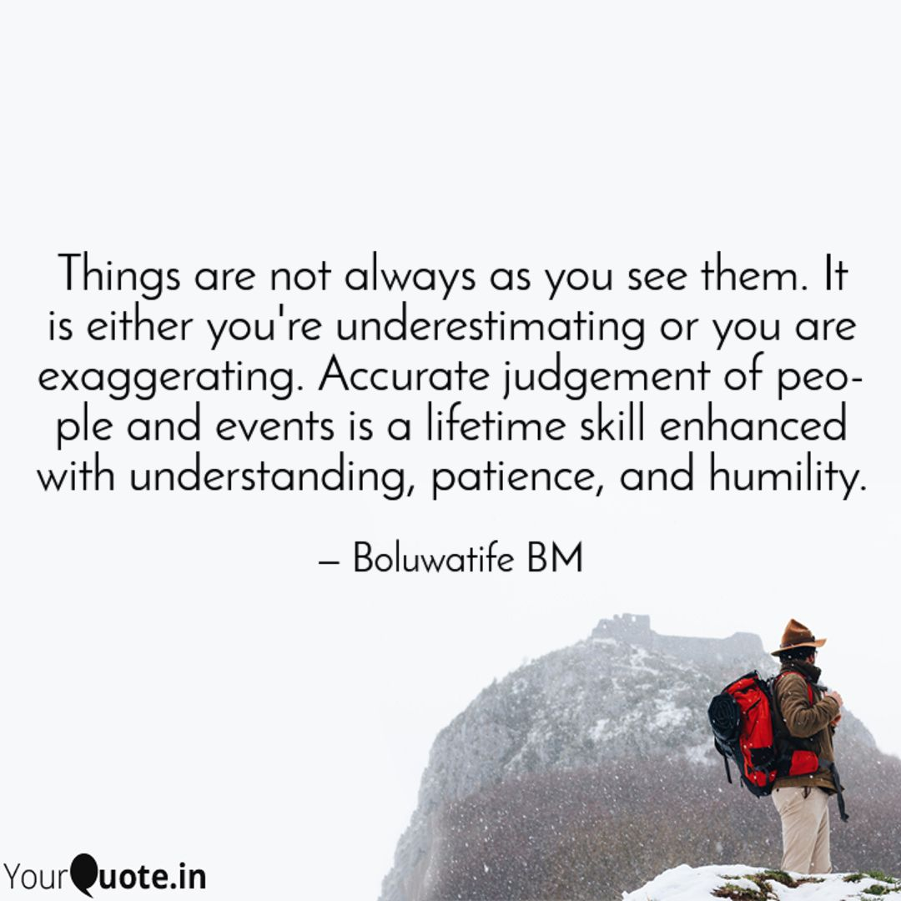

Every encounter with a person or situation presents us with an opportunity to choose between two responses. These two responses flow from two basic types of evaluation, face-value or intrinsic. Both are important but should not exist separately.

Face-value evaluation will judge a person by criteria such as a one-minute conversation with the person or by what someone else has said and an event or situation by criteria such as its current impact on one's life, and the possible downturn it can take. Intrinsic evaluation, on the other hand, will desire to dig into the nature of a person beyond mere words, attire, or possessions and will seek to know the possible causes of an event, the possible solutions, and ways to avoid such occurrences in the future. Outrightly deciding out of a face-value evaluation often turns out to be a wrong analysis, and with wrong analysis, come wrong conclusions and recommendations. Hence, there is a great need to progress to the other type of evaluation.

It is important to note that evaluating things intrinsically is not a one-stop show; it's a skill that comes from progressive training all through a lifetime. It's not learned in a hurry; understanding, patience, and humility are the primary keys to have. This skill is useful for building all kinds of relationships and responding to and overcoming various situations. It is not an age-selective skill either; the earlier we start learning, the better we are for it. Moreover, the more we grow is the more dangerous it is for us to continue to judge things at face value. Discernment (which means to see or understand difference) is one of the indices of maturity.

Hebrews 5:14 (NLT): *Solid food is for those who are mature, **who through training have the skill to recognize the difference between right and wrong.***

Truthfully, no man is capable of judging rightly without the help of the One who sees all, knows the heart of every man, and knows the end from the beginning. The truth is that He sovereignly rules overall. The earlier we realize how short-sighted we are, the better for our growth. We will always fall short in our judgments until we decide to deliberately and continually acknowledge the Accurate Judge of all, the Lord GOD.