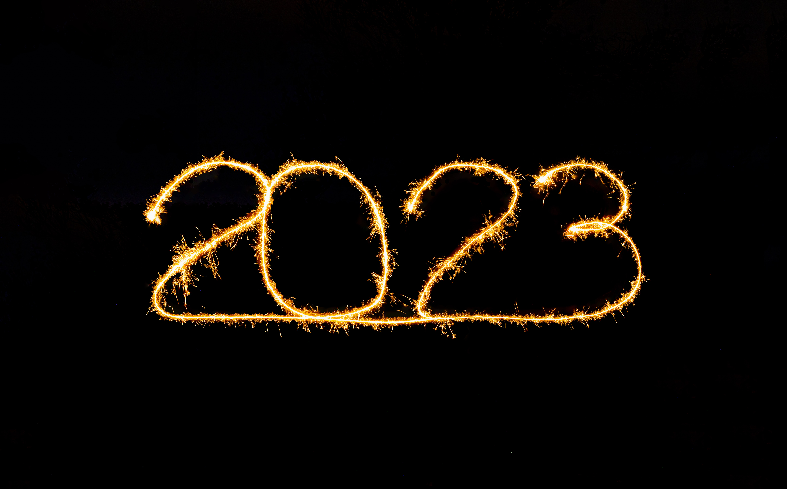

What kind of emotions did you launch the year 2023 with? Were you happy, excited, sad, frustrated, disappointed, angry, or surprised? Whatever might have been the kind of emotion you had, it is still in your hand to determine the kind of emotion that will rule your affairs in each minute of the year. This pertains to every sphere of your life and will impart every one of your relationships and work/project. Choose and let that choice guide your thoughts and actions.

Don’t be quick to write off any day until that day is gone. Anything can happen in just a minute. So, rise to give things a shot. Take that risk. Make that call. Tender that apology. Submit that form. Start that project. Make demands on life with your thoughts and actions rather than being laid back and just wishing. If wishes could make things happen, no one would be on the streets struggling. Panel-beat your wishes into goals and make plans that will lead you to those goals.

Very importantly, there is something we need to take heed of this year.

*Woe to the man who fights with his Creator. Does the pot argue with its maker? Does the clay dispute with him who forms it, saying, “Stop, you’re doing it wrong!” or the pot exclaim, “How clumsy can you be!”? Woe to the baby just being born who squalls to his father and mother, “Why have you produced me? Can’t you do anything right at all?”* Isaiah 45: 9-10

If you're still struggling with God on any matter, or maybe you have chosen to be nonchalant about His will, it means you're deliberately signing up for woes. You didn't create yourself, so you'll be doing yourself a great favour to let the Creator dictate your path and pace. Join the company of **the willing and obedient**. Be sure your goals flow from your knowledge of His will for your life, otherwise you may just be chasing the wind all through. He is The Way, so He knows the way you need to go to maximise time and resources. He knows who will be a help to you and who will drain you. He knows the habits that don’t align with His picture of you and the things you need to unlearn, learn, and re-learn.

We all have the same number of hours each day but the quality of life we will lead is directly proportional to the value we place on each time we get when we arise in the morning.

Remember:

*If you are willing and obedient, you shall eat the good of the land; but if you refuse and rebel, you shall be eaten by the sword; for the mouth of the Lord has spoken.”* Isaiah 1:19-20

There’s an Expected End for You and Me !!!