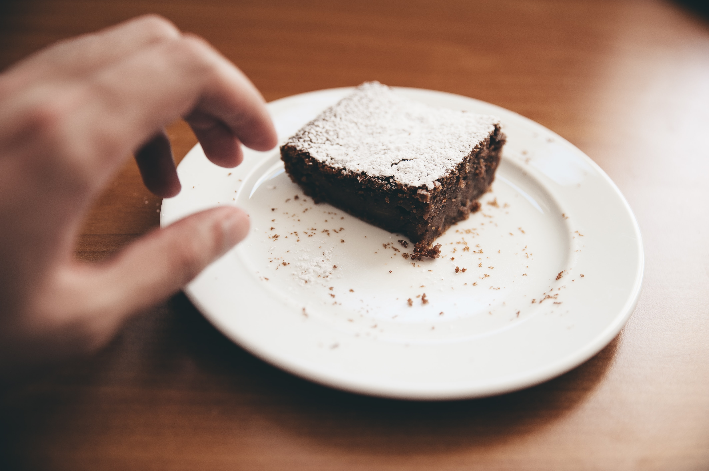

Prior to this time, an average child should only know sex as male/female, but increased civilization and the abounding of technology continue to erode that innocence. Thus, to evade talking about sex now is more of a disservice to humanity. It is even more disheartening to hear that some toddlers are already involved in sexual activities, not to talk of children and teenagers. It is beginning to look like a norm that must be done to be among the happening league in our institutions. Whoever isn’t yielding to that deceit is seen as an outcast or illiterate. Advertisements, even for daily needs, are becoming more and more sexually arousing. Where have we gotten to and what can we do?

Originally, sex was created to be a bonding “ritual” between a husband and his wife who have become one. It is indeed meant to also give pleasure and it is also the way through which procreation occurs. This means that “Sex is good” is only acceptable within the confines of marriage. Outside marriage, sex begins to take up other names like fornication, adultery, masturbation, etc. Along the line, however, there’s been a lot of redefinition by people and for the people, all in a bid to begin to rub their consciences on the head, so that they can, without guilt, do now what is for later. In short, they cannot delay gratification.

Another deception ravaging the younger generation is that anything that is done without penetration is not sex. Lies! Why did the dictionary call it foreplay? It means those activities like kissing, fingering, masturbation, pornography, and romance of any kind are all sexual activities regardless of where, when, or how they are done. Let’s pick out one of them; Masturbation. Some people say it’s medicinal for the male folks, some say it is okay since no one else is participating, and others even say it is a preventive measure for going into fornication or adultery. Whatever your own thought of it is, if it is actually good, why do we need so many excuses for it and why do we have to hide to do it???

Sex is Sex! Whether done by self, including others, in the room, on the rooftop, at a young or old age, nothing changes. Do you even know that some tell Young girls who have just come into puberty and are having menstrual pains that penetrative sex will stop the pains? How now??? There are other lies that remaining a virgin for too long can affect you later in life or that (for people in marital relationships) you need to have sex to test your compatibility or fertility. Lies ooo! How will you not fall for these lies? By searching out, knowing, and standing for the truth. And you don’t get the truth on social media platforms or the internet, you get the truth from the originator Himself; God via the Bible. God gave us some insights on sex outside marriage in I Corinthians 6:13-20 TLB.

*But sexual sin is never right: our bodies were not made for that but for the Lord, and the Lord wants to fill our bodies with Himself…That is why I say to run from sex sin. **No other sin affects the body as this one does.** When you sin this sin it is against your own body. Haven’t you yet learned that your body is the home of the Holy Spirit God gave you, and that He lives within you? Your own body does not belong to you. **For God has bought you with a great price. So use every part of your body to give glory back to God because he owns it**.*

Sex is beyond just the activity and time, it runs deep. Really enjoyable now but comes with great consequences sooner or later. It makes you feel among now but eventually reduces you to crust among your brethren. It is enjoyed secretly now but will soon be declared on the rooftop by the consequences it brings. Besides separation from God (via guilt), it gives access to the devil to afflict you and yours in several ways and also has numerous physical consequences like Sexually Transmitted Diseases, unwanted pregnancies, abortions, and even death. No excuse is tenable. Were you raped/introduced too early into it? You’ll be doing yourself a disservice to continue that way. Whatever made you start cannot make you continue without your own consent. You can always rewrite your own story TODAY!

Flee, is what God says, from EVERY appearance of evil; songs, friends, chats, subscriptions, channels, books, environment, habits, etc. that tend to lure you into any and every sexual activity should be totally avoided. Let him who stands take heed lest he falls. Set boundaries, pay attention to those you walk/work with, deal with unwholesome thoughts urgently and replace them with the ones listed in Philippians 4:8, spend time in communion with God via prayer and His word, and be accountable to people when temptations come calling. Always put before you a vision of your future and ask if you want to trade with it on the altar of sex.

**Everyone is doing it, but you’re not everyone! Take your stand. Patiently wait for the right time. It is folly to steal and secretly eat your own lunch for breakfast. What will you do when it's time for lunch? The multitude is not always right. Follow the Way Himself: Jesus Christ!**