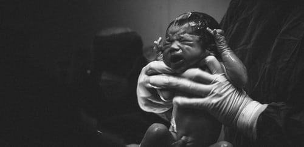

2 Corinthians 5:17 *Therefore if any man be in Christ, he is a **new creature**: old things are passed away; behold, all things are become new.*

Galatians 6:15 *For in Christ Jesus neither circumcision availeth anything, nor uncircumcision, but a **new creature**.*

The word "New" in this context, means something that has just come into existence. It hasn't existed before, and it is not old. The word "creation", which is also rendered as creature in some other versions, refers to something that has been created, whether animate or inanimate.

Thus, **New Creation** speaks of something/someone that has just been created. And in this case, we're referring to human beings.

**What makes a man a New Creation?**

A new baby is a new creation by virtue of the definitions earlier given. But in this case, the new creation is not about just coming into the world as a baby. Infact, we are conceived in sin. Psalm 51:5

Thinking about it, a baby is not called a man until he/she has attained a certain age. How then can a full-grown man be called or become a New Creation???

Considering the process of conception that brings a baby (new creation) into the world, it is logical to understand that a similar process will occur to have a man become a New Creation.

*Jesus answered him, I assure you, most solemnly I tell you, that unless a person is born again (anew, from above), he cannot ever see (know, be acquainted with, and experience) the kingdom of God. Nicodemus said to Him, How can a man be born when he is old? Can he enter his mother’s womb again and be born? Jesus answered, I assure you, most solemnly I tell you, unless a man is born of water and \[even] the Spirit, he cannot \[ever] enter the kingdom of God. What is born of \[from] the flesh is flesh \[of the physical is physical]; and what is born of the Spirit is spirit.* John 3:3-6

So many important matters in the verses above, but we'll concentrate on verse 3.

... Unless a man is born again...

... If any man be in Christ... 2 Cor. 5:17

Thus we can safely equate being born again to being in Christ. **This means that whosoever will be a new creation is one who has been born again, i.e. he is now in Christ**.

How, then, does a man become born again, or be in Christ?

*Because if you acknowledge and confess with your lips that Jesus is Lord and in your heart believe (adhere to, trust in, and rely on the truth) that God raised Him from the dead, you will be saved.*

*For with the heart a person believes (adheres to, trusts in, and relies on Christ) and so is justified (declared righteous, acceptable to God), and with the mouth he confesses (declares openly and speaks out freely his faith) and confirms \[his] salvation.* Rom. 10:9-10

**The New Creation is any man/woman, boy/girl, white/black, that has acknowledged and confessed Jesus as His Lord and believed in His heart that God raised Him from the dead.**

**What comes with being a New Creation?**

Let's revert back to the conception process. Before a child is born, his abode is the womb of the mother, it feeds on whatever the mother feeds on, sleeps, and does whatever is to be done within the confines of the mother's womb.

However, when the baby is born, he/she begins an entirely different life; the feeding channel and pattern changes; the sleeping pattern changes. He comes into an entirely different world from what was obtainable in the womb.

The same applies to any man that is now in Christ. **All things are new**. The physical body doesn't change, the face doesn't change. But there's a change... One thing we must know is that for The New Creation, **the past is past**. Regardless of how sinful or moral, how loving or hateful, how pleasant or unpleasant, how good or bad, **old things are passed away**.

*Therefore if any person is \[ingrafted] in Christ (the Messiah) he is a new creation (a new creature altogether); **the old \[previous moral and spiritual condition] has passed away. Behold, the fresh and new has come**!* 2 Cor. 5:17

Referring to verse 6 of John chapter 3, we have a glimpse into what happens when a man becomes a new creation. **It is a birthing by the Spirit, to become alive in the spirit.** We all died by virtue of what happened in Genesis 3, and come alive when we fulfill the requirements of John 3. Our spirit is no longer dead, but alive to God. Romans 6:11

What also comes with being a New Creation? Circumcision no longer counts as a requirement for getting God's approval.

***Circumcision doesn’t mean a thing to me. The only thing that really matters is living by the transforming power of this wonderful new creation life.*** Gal. 6:15

Circumcision, here, gives a picture of **religious** works targeted at getting God's approval.

It no longer counts!!! The new Creation stops doing works just to get the Father's attention, or to save himself from punishment! The New Creation does works that flow from His being in Christ, works from a revived and renewed spirit, works led by the Spirit of God indwelling His spirit.

Works don't count as a prerequisite for getting to the Father, but they will naturally flow from the New Creation as fruits...

*But someone might object and say, “One person has faith and another person has works.” **Go ahead then and prove to me that you have faith without works and I will show you faith by my works as proof that I believe.***James 2:18

How come, men, who have become new creation, still live with the old as their source???

How come we can't distinguish the works of the old man from one who has become a New Creation???

We can safely conclude that the New Creation can continue to live like the old, if he fails to acknowledge, understand, and walk in the newness that has been made available to him. **Simply put, someone who is born-again that can't be distinguished from an unbeliever doesn't know who he is!**

Does this statement above apply to anyone who backslides or falls into sin?

The first step to answering this question is to know what "backsliding" and "falling into sin" means. To backslide is to start doing something bad again after you have stopped it and to fall into sin is to sin; where sin is purely disobedience to God's instructions (those clearly stated in His word and those said personally to you.) All unrighteousness is sin. 1 John 5:17

Basically, by our configuration, whoever is in Christ is meant to live without sin... This is why Apostle John would write...

*My little children, I write you these things so that you may not violate God’s law and sin. But if anyone should sin, we have an Advocate (One who will intercede for us) with the Father—\[it is] Jesus Christ \[the all] righteous \[upright, just, Who conforms to the Father’s will in every purpose, thought, and action].* 1 John 2:1

...But because of how deep the flesh has run into us, a sudden change happens within (our spirits), but have to be patiently worked to our without (souls, then, body). So every time we do what we call "sin", it is in contrast to who we really are... That's why scriptures will admonish us to immediately run to God, confessing our faults, and receiving the forgiveness He provided with the blood of Jesus years ago, so that the devil won't have something to hold on to, or accuse us of.

**What makes a believer different from an unbeliever is our faith in God** (note that this faith is not just about believing that God exists or not). This faith is explained in Romans 10, especially verses 9-10, and our faith in God doesn't end within us, it must be commensurate with **everything** we do.

At the point of Salvation, I accept Jesus as my **Lord and Savior**, and I'm expected to relate with Him as **Lord and Savior**, meaning He is to dictate everything I do and save me from anything that is outside of Him. Thus, any time I err, it shows that I didn't allow Him to do what He should do in that instance, and I'm reminded that more acknowledgment of His Lordship and Salvation is required for me.

In other words, **Becoming a new creation as soon as we become born again is constant, but living the life is dependent on the individual**.

**What is expected of The New Creation?** The basic things are:

1. Constant renewal of the mind. Romans 12:1-2

2. Walking in the Spirit. Gal. 5:16

3. Praying. I These. 5:17, Jude 20

4. Obedience. I Sam. 15:22-23, John 10

5. Studying the Word and other Christian literature. I Tim. 2:15