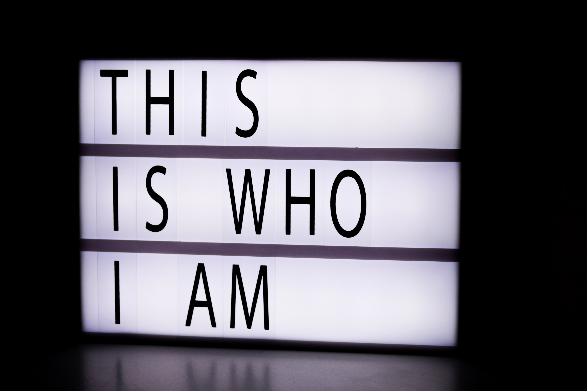

“Who are you?” Is a question that you often get at a point of introduction to another person; could be at an event or an interview. Most times, you are disposed to saying your name, what you do, and possibly your location. The content of the answer to the question differs from person to person and in fact, from place to place i.e. the kind of people you’re dealing with in the area.

Away from the interview or networking setting, there is a need to personally answer this question with proper consideration of another angle of view - that of an outsider. What can you say about yourself and will it complement what others see? If one of your family members, friends, or colleagues is mandated to speak for you where it matters most, would you be on the winning side?

Let’s take our lens closer. How do we “measure” this “Who are you?”

Character! And Character has two siblings: What you do and What you say!

More clearly stated, what you do and say day-in-day-out sums up your character which is an overview of who you are. What about your thoughts? You should remember the scripture that says “As a man thinks in his heart, so is he.” What does that verse mean? It takes the supernatural to see another man’s thoughts like Jesus did. However, every man can know the thoughts of another man by what he says or does. Simply put, a man’s thoughts dictate what he will say or do which tells who he is.

Just like an architect designs the features of a house while the structural engineer designs how the house will stand, you are the architect and structural engineer of your life. It is what the architect drew that will be seen by people, so it is what you portray (say or do) to people that they will see. However, regardless of what is seen, if the structural design is poorly done, the house will collapse in a matter of time and people will come to loathe the architectural designs they saw at first. This means that the real you when no one is there is what keeps the you that people see beautiful. 

What do you say to and about yourself? What do you think you can or you cannot do? What efforts are you putting in in the secret? What are you doing to improve your skills and knowledge base? What efforts are you known for in your family, among your colleagues, in your career, etc? Most importantly, what are you doing to grow in your relationship with God? When the scripture says, “The creature awaits the manifestation of the sons of God,” don’t you know that that manifestation will also show those who have the form but deny the power thereof? The truth is there will be a great limitation in knowing who we are if we fail to constantly look upon the words of the ONE who created us. It’s time to be responsible!

This character we are talking about is not just about putting up a charade for people to see. In fact, sooner or later, men will always see through it to the real you (https://thelearnedtongue.com/blog/attitude/). Your character goes beyond what you say or do when others are around, it is also what you say or do when no one is around. It is who you are in the morning, noon, night, in private or public, when you’re employed or unemployed, when you’re single or married, etc. It is who you are always.

One good thing about character though, is that it is not static. It is meant to get better by the day. The unwillingness to change what a man would normally say or do (especially the bad or inappropriate ) brings about the loss of some friends, jobs, contracts, gifts, and so on. In the same vein, the willingness and commitment to change for the better, even though looked stupid at first, made others prosper in several ways in the end.

Character doesn’t happen accidentally. It is intentionally built. It doesn’t happen overnight, it requires consistency. It is not something someone else can do for you, it is what you do for yourself. It is not first an external change, it is first an inner work (your thoughts). And you’re the best evaluator of what is and what is not as you get to dictate what other people will see.

Who are you now? And,

Who will you be?

The distance between who you are and who you will be is covered by time and effort. Start now!